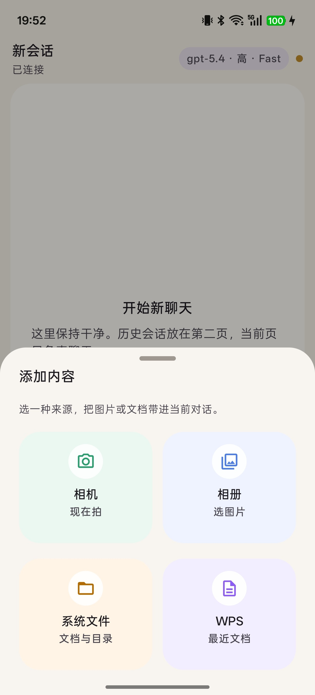
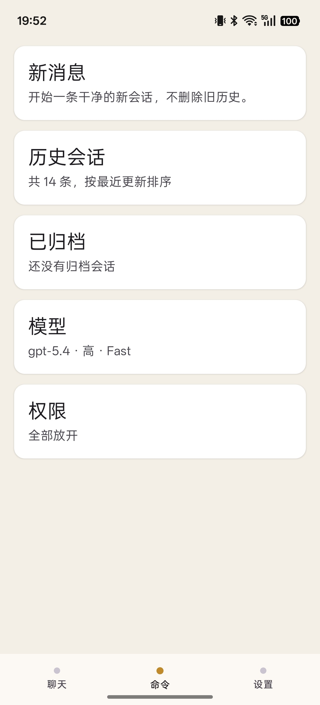
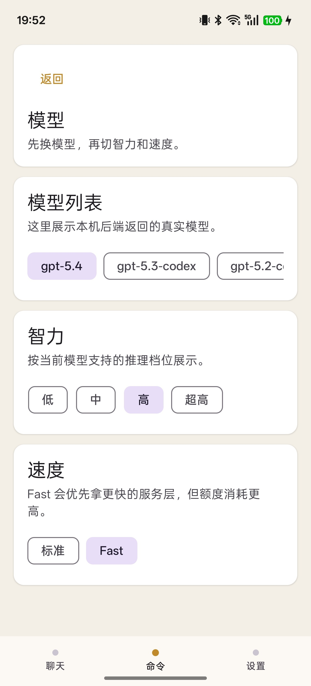
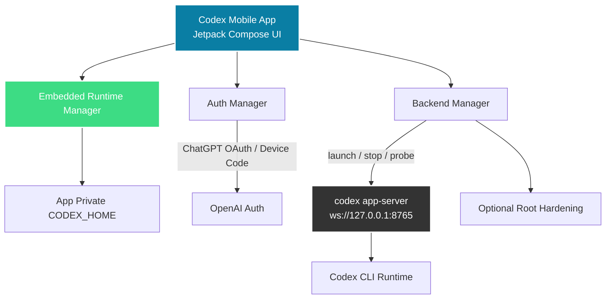

# Codex Mobile

[](https://github.com/aeewws/codex-mobile-oneapk/actions/workflows/android-ci.yml)
[](LICENSE)


The primary repository experience is Chinese-first. For the main landing page, see [README.md](README.md).

Codex Mobile is an Android app that turns a real local Codex runtime into a phone-native product instead of a terminal-first workflow.

This rebuild no longer depends on the Termux app itself. The APK embeds an arm64 runtime payload, manages its own private `CODEX_HOME`, and controls `codex app-server` directly from the app.

Quick links: [Project brief](docs/project-brief.en.md) · [Setup](docs/setup.en.md) · [Roadmap](docs/roadmap.en.md) · [Chinese README](README.md) · [Contributing](CONTRIBUTING.md) · [Security](SECURITY.md)

## Direct Download

If you want to install and try the app without building from source, download the APK from Releases:

- [Latest release](https://github.com/aeewws/codex-mobile-oneapk/releases/latest)
- Recommended asset: `codex-mobile-oneapk-oss-debug-arm64-v8a.apk`

Fastest path after install:

1. Install the APK
2. Allow the required runtime permissions on first launch
3. If the device is rooted, grant root to improve keepalive and background recovery
4. Open the command page and use `Login` or `Device Code`
5. Start using Codex after auth completes

## Why This Exists

The terminal workflow is powerful, but it is not a good mobile product. Codex Mobile is an attempt to make local AI coding usable on a real Android phone without pretending the terminal is the final UI.

The project is focused on:

- chat-first mobile interaction
- thread recovery after reconnects or backgrounding
- local backend lifecycle management
- exposing model, reasoning, and permission controls without raw terminal UX
- keeping login, logout, and device-code auth inside the product flow

## What Changed In This Rebuild

- single APK: the app manages an embedded arm64 runtime instead of depending on an external Termux app
- app-private state: auth, config, session index, and backend logs live under the app's private `CODEX_HOME`
- in-app auth: browser OAuth, device-code login, and local logout are exposed in the command UI
- app-managed backend: the app probes, starts, stops, and restarts `codex app-server --listen ws://127.0.0.1:8765`
- root is optional: it is now mainly used for keepalive and hardening rather than basic runtime availability

## Current Status

Codex Mobile is an active prototype shaped by real device use.

- Android app built with Jetpack Compose
- supports packaging a community-built Codex arm64 runtime into the APK at build time
- first public target is `arm64-v8a`
- in-app login, device-code auth, logout, and backend recovery
- Chinese-first UI and repository presentation
- root is optional, but improves keepalive and background reliability

This repository is the app project itself. It is not a one-click exported phone image.

## Screenshots

| Attachment Sheet | History | Settings |
| --- | --- | --- |
|  |  |  |

## Current Features

- unpack the embedded runtime into the app-private directory on first launch
- auto-start and reconnect to the local `codex app-server`
- mobile chat UI for real Codex threads
- history, archive, restore, rename, and delete flows
- model switching, reasoning level switching, permission modes, and Fast mode
- browser OAuth login, device-code login, and local logout
- image and document attachment entry points in the main UI
- long-thread recovery improvements for unstable mobile/runtime conditions

## Architecture



## Repository Health

- Android CI runs on pull requests and on pushes to `main`
- issue templates and a pull request template are included for repeatable maintenance
- dependency updates are configured through Dependabot
- a basic security policy and maintainer ownership file are included

## Compatibility And Setup

Direct end-user expectations:

- Android 9+ device
- `arm64-v8a`
- a usable browser on-device
- optional root; root improves keepalive and background reliability

Developer build environment:

- Android 9+ device
- `arm64-v8a`
- a build-time runtime archive or unpacked directory to package into the APK
- a usable browser on-device for OAuth or device-code verification
- optional root access for keepalive and background hardening

Quick start and environment notes live in [docs/setup.en.md](docs/setup.en.md).

This project is best evaluated as "an Android product shell around a local coding runtime", not as a general-purpose Android app that can run without environment assumptions.

## Development

Build channels:

- `legacyDebug` keeps package compatibility with the working phone install line
- `ossDebug` uses the public `io.github.aeewws.codexmobile` application id for open-source distribution

Provide a runtime input before building, for example:

```bash
export CODEX_MOBILE_RUNTIME_ARCHIVE=/absolute/path/to/@mmmbuto/codex-cli-termux/package
```

Local development commands:

```bash
./gradlew testLegacyDebugUnitTest testOssDebugUnitTest
./gradlew assembleLegacyDebug
./gradlew assembleOssDebug
```

The repository also includes a GitHub Actions workflow that builds both debug channels on pushes and pull requests.

## Project Scope

This repository intentionally excludes private and device-specific runtime data.

Not included here:

- app-private auth files and login caches
- local Codex session history
- runtime backup archives
- device-specific proxy or root configuration
- private debugging artifacts
- local `local.properties`

## Limitations

- first release supports `arm64-v8a` only
- the runtime payload must be injected at build time and is not committed to the repo
- keepalive and root-hardening behavior still vary by device, ROM, and root stack
- device-code verification page compatibility is still being polished
- reconnect and long-thread stability are still being hardened

## Open Source Direction

Immediate repository priorities are tracked in [docs/roadmap.en.md](docs/roadmap.en.md).

If you want to contribute, start with [CONTRIBUTING.md](CONTRIBUTING.md).

## Notes

This project is not affiliated with OpenAI or Termux. The APK currently embeds a community-packaged Codex CLI arm64 runtime, but the runtime lifecycle is managed by the app itself.

## License

This project is released under the [MIT License](LICENSE).
