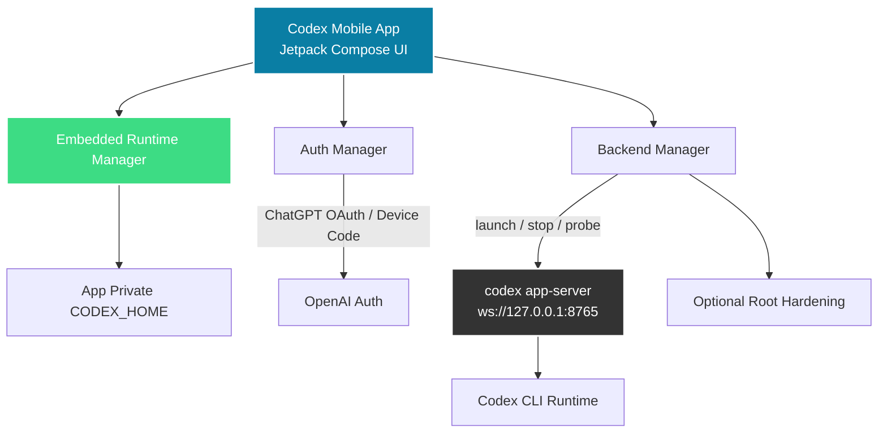

# Codex Mobile

[](https://github.com/aeewws/codex-mobile-oneapk/actions/workflows/android-ci.yml)
[](LICENSE)


Codex Mobile 是一个面向 Android 的 Codex 手机版，目标是把真实本地 Codex 运行时做成更像产品、而不是更像终端工具的手机体验。

这一版不再依赖 Termux App 本身，而是把 arm64 运行时打包进 APK，由 App 自己管理本地 runtime、认证状态和 `codex app-server` 生命周期。

英文说明见 [README.en.md](README.en.md)。旧中文入口保留在 [README.zh-CN.md](README.zh-CN.md)。

快速入口：[项目说明](docs/project-brief.md) · [环境与安装](docs/setup.md) · [路线图](docs/roadmap.md) · [英文 README](README.en.md) · [贡献说明（英文）](CONTRIBUTING.md) · [安全说明（英文）](SECURITY.md)

## 为什么做这个项目

Codex 的终端工作流很强，但它并不是一个适合手机触摸使用的产品。Codex Mobile 想解决的不是“把终端搬上手机”，而是把本地 AI coding workflow 收成一个更像移动产品的体验。

当前重点是：

- 聊天优先的移动端交互
- 后台恢复、重连和线程续接
- 本地 backend 生命周期管理
- 把模型、智力、权限等控制做成手机上能用的界面
- 让登录、登出和设备码授权都留在 App 体验里

## 这一版和旧方案的区别

- 单 APK：App 自己管理内置 arm64 runtime，不再依赖外部 Termux App
- App 私有 `CODEX_HOME`：认证、配置、会话索引、日志都放进应用私有目录
- App 内登录：支持浏览器 OAuth、设备码登录和本地登出
- App 自己拉起 backend：围绕 `codex app-server --listen ws://127.0.0.1:8765` 做探测、重启和恢复
- root 变成增强项：主要用于保活和系统白名单，不再是“能不能运行”的唯一前提

## 当前状态

这个项目不是概念演示，而是一个还在持续打磨的活跃原型。

- 基于 Jetpack Compose 的 Android App
- 支持把社区版 Codex arm64 runtime 作为构建产物注入 APK
- 首版面向 `arm64-v8a`
- App 内支持登录、设备码授权、登出和 backend 自动恢复
- 当前 UI 以简体中文为主，仓库文档也切到中文优先
- root 可选，但启用后能得到更强的后台保活和白名单加固

仓库公开的是 App 工程本身，不是一份一键还原某台手机的整机镜像。

## 截图

| 添加内容 | 历史会话 | 设置 |
| --- | --- | --- |
|  |  |  |

## 当前能力

- 首次启动时解压 APK 内置 runtime 到 App 私有目录
- 自动探测并拉起本地 `codex app-server`
- 在手机上继续真实 Codex 线程
- 历史会话、归档、恢复、重命名、删除流程
- 模型切换、智力档位切换、权限模式和 Fast 模式
- 浏览器 OAuth 登录、设备码登录和本地登出
- 图片与文档附件入口，支持从相机、相册和文件选择器添加内容
- 对长对话和移动端不稳定场景做了恢复优化

## 架构概览



## 仓库维护信号

- Android CI 会在 pull request 和 push 到 `main` 时运行
- 仓库已经补上 issue template 和 PR template
- Dependabot 已配置用于依赖维护
- 也补了基础的安全说明和代码所有权文件

## 环境与运行预期

当前预期环境：

- Android 9+ 设备
- `arm64-v8a`
- 构建时提供一份可打包的 Codex arm64 runtime 目录或压缩包
- 手机上可用浏览器，用于 OAuth 或设备码授权
- root 可选；若可用，将用于保活和白名单增强

更详细的说明见 [docs/setup.md](docs/setup.md)。

更准确地说，这个项目更适合被理解为“围绕本地 coding runtime 的 Android 产品外壳”，而不是一个无需环境假设就能直接跑起来的通用 App。

## 开发

构建渠道：

- `legacyDebug` 保持和你手机当前可用安装线一致，方便覆盖升级
- `ossDebug` 使用公开仓库对应的 `io.github.aeewws.codexmobile` 包名，适合开源分发

构建前需要提供 runtime 构建输入，例如：

```bash
export CODEX_MOBILE_RUNTIME_ARCHIVE=/absolute/path/to/@mmmbuto/codex-cli-termux/package
```

本地常用命令：

```bash
./gradlew testLegacyDebugUnitTest testOssDebugUnitTest
./gradlew assembleLegacyDebug
./gradlew assembleOssDebug
```

仓库里的 GitHub Actions 会在 push 和 pull request 时同时构建两条 debug 渠道。

## 仓库边界

这个仓库只公开 App 工程本身，不公开设备私有运行环境。

仓库里不包含：

- App 私有认证文件和登录缓存
- 本地 Codex 会话历史
- 运行环境备份压缩包
- 设备专用代理或 root 配置
- 私有调试产物
- 构建机本地 `local.properties`

## 当前限制

- 首版只支持 `arm64-v8a`
- runtime 产物需要在构建时注入，仓库本身不直接提交运行时压缩包
- root 增强行为仍然会受到机型、系统和 root 工具差异影响
- 设备码验证页的浏览器兼容性仍在持续打磨
- 长线程和重连稳定性还在持续加固中

## 开源推进方向

近期计划见 [docs/roadmap.md](docs/roadmap.md)。

如果你想参与贡献，可以先看 [CONTRIBUTING.md](CONTRIBUTING.md)。

## 说明

这个项目与 OpenAI、Termux 官方没有隶属关系。当前 APK 内置的运行时来源于社区封装的 Codex CLI arm64 产物，但运行时生命周期由 App 自己管理。

## 许可证

本项目使用 [MIT License](LICENSE)。
